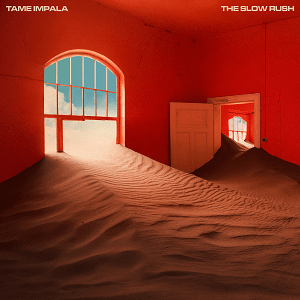

Album artworks can influence how certain projects permeate throughout culture and font selection is a large aspect of this. There are many iconic artists that have associated themselves with a particular aesthetic for extended periods of time; think of the iconic stylized font used for the AC/DC logo

 or the memorable yet minimal trademark font of fellow Australian music project Tame Impala (Microgramma).

Cooper Black is an eponymous font, named after its creator Oswald Cooper in 1919. It is a fairly low contrast font that is defined by its thick lettering. It is easily legible and recognisable, which album cover artists began to take notice of in during the psychedelic movement of the 60s. All of the sudden, experimental music projects inspired by eastern music methodology and the progressive politics of the hippie movement were using Cooper Black on their album covers. Notable uses include Pet Sounds by the Beach Boys (1966), Freak Out! By Frank Zappa’s The Mothers of Invention (1966) and LA Woman by the Doors (1971).

, Freak Out! By Frank Zappa’s The Mothers of Invention (1966) and LA Woman by the Doors (1971).")