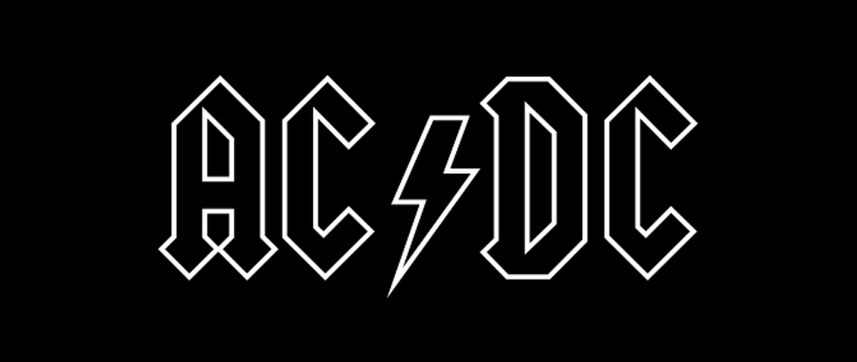
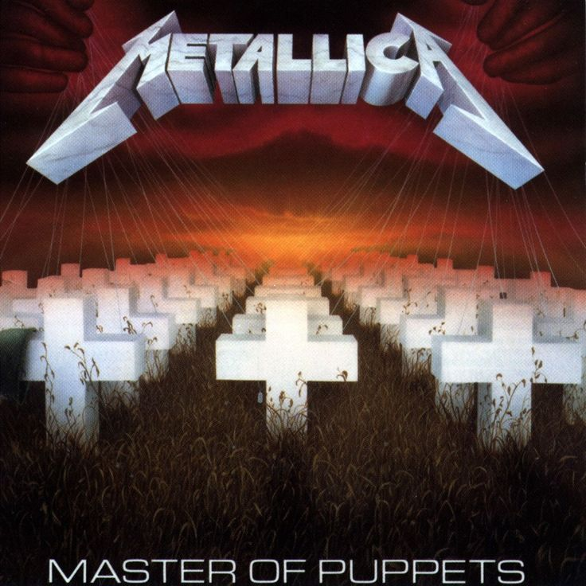
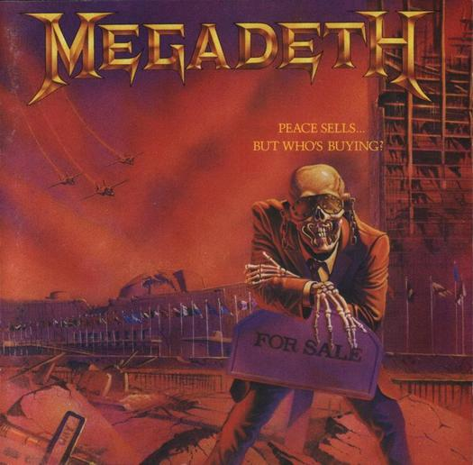
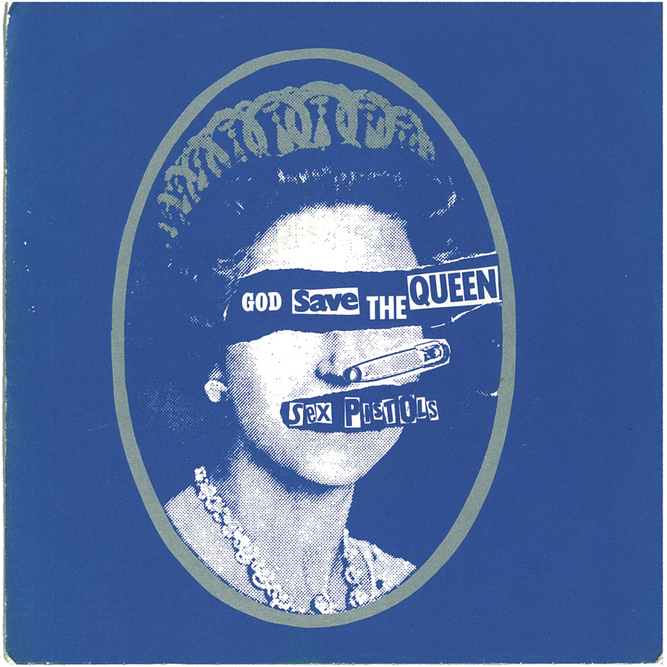
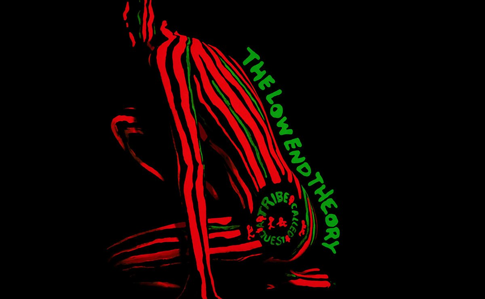
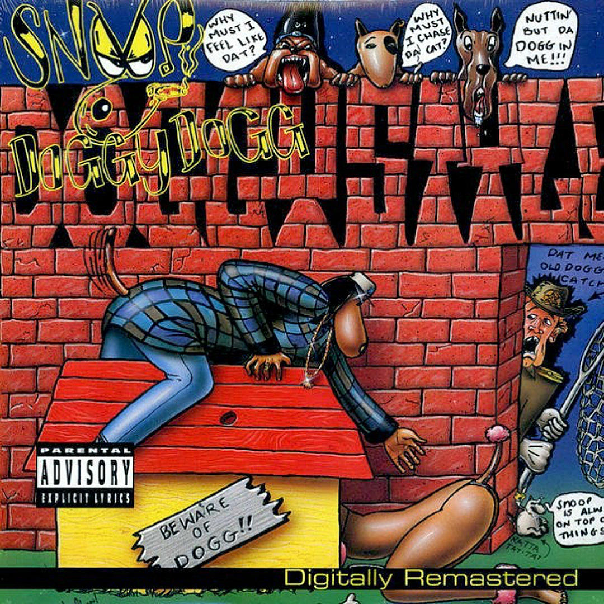

Certain aspects of typography can become particularly significant within a genre. Within this article are some compiled examples of genre-based clichés using typography.

**Metal/ hard rock**

These genres of music often contain uses of fonts that have jagged edges and points. Examples include the fonts used by Metallica, AC/DC and Megadeth. Metal is often associated with the occult and potentially other historically disconcerting cultures, and cover artists have taken note.

The sharp corners of these bands logos could be compared to horns or blades. The edginess of the genre is reflected within the promotional art and the aesthetic of the art is often placed above the legibility of the writing.

**Punk**

A cliché in punk music promotional art is often the ‘ransom style’ typography popularised by The Sex Pistols. The DIY nature of the genre and counter-culture ideology often associated with punk music are reflected in this style of typography, with words seemingly cut out from pre-existing printed works and plastered next to each other to create a new sequence of words. One of the main connotations of this style is the famous ransom notes written in this style, done so that the author could not be identified by handwriting analysis – a type of analysis used in the search for the Zodiac Killer.

**Rap music**

Admittedly broader than the previous genres addressed, rap has many sub-genres and underground scenes that have their own sets of clichés and artists paying homage to their predecessors. One style of typography that has remained constant throughout the years, spanning sub genres and different levels of commercial viability. This is the stencil style of typography. Graffiti was a form of art often associated with the underground hip hop scene and, naturally, this carried over into the work of artists from this kind of background.

Classic examples include legendary albums like *Doggystyle* by Snoop Dogg and *The Low End Theory* by A Tribe Called Quest, released in 1993 and 1991 respectively. 

Though this trend was popular in the 1990s, it has maintained relevance through contemporary hip hop artists that pay homage to their predecessors in their scene through this style of typography on their album art. Earl Sweatshirt is an artist that comes to mind, with his 2013 album *Doris* having a stencilled design on the cover.

  by Earl Sweatshirt")