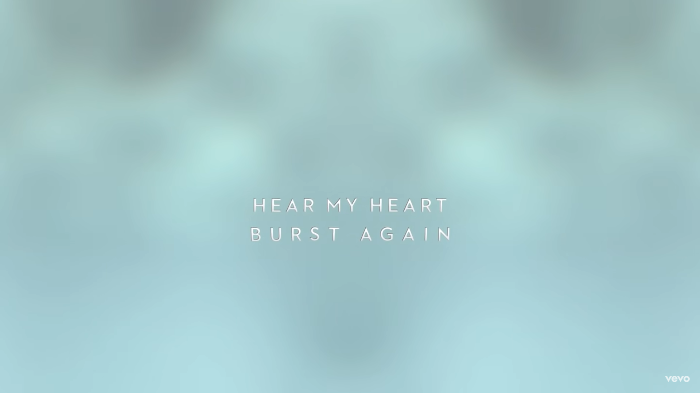
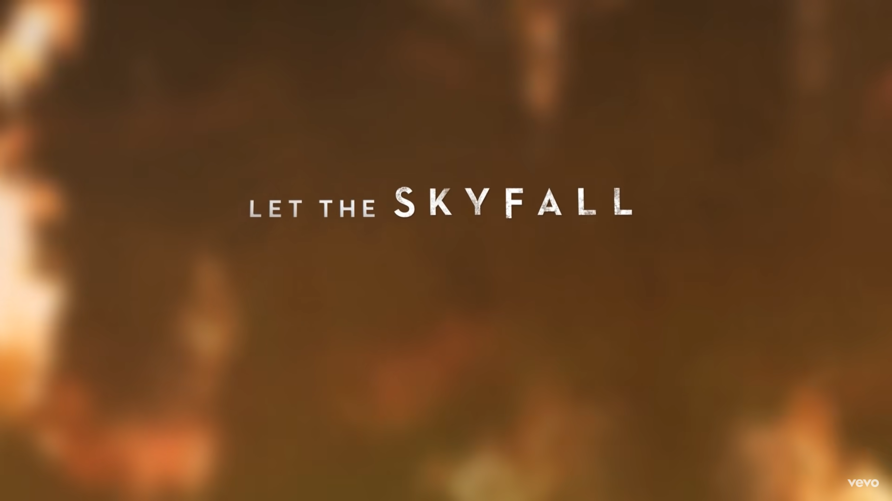
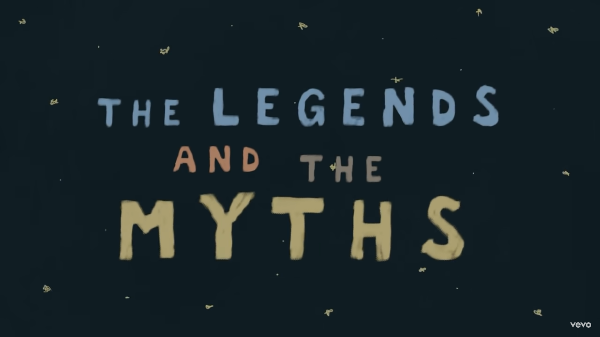
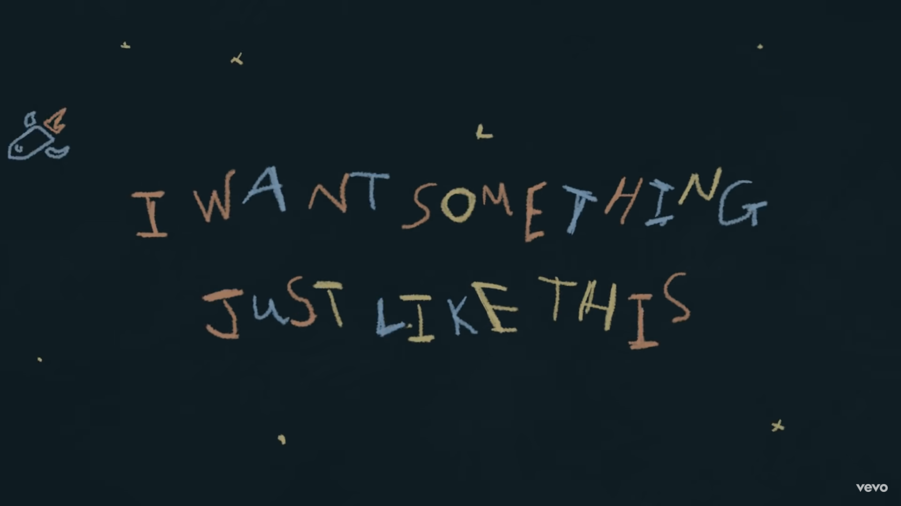

Lyric videos are an interesting concept. They exist to detail the lyrics of a song but are officially licensed by the publisher of the song and technically count towards official streaming numbers. Though they are not what is traditionally considered to be a music video, they have the unique challenge of transcribing lyrics in a manner that is legible yet stylistically engaging. The ways they engage the viewer can range from the typography and animation of the lyrics themselves or the background/ secondary content within the video. A prime example of a simple, yet elegant and engaging lyric video is *Skyfall* by Adele, the title theme for the similarly titled Bond film from 2012.

The video, which has over 400 million views on YouTube at the time of writing, uses a low contrast, low weight sans serif font. Though the font is not very thick, the choice of white text on darker, contrasting background colours lends itself to a sense of elegance. When the chorus kicks in, the only word in the entire song to be highlighted in any way is the title of the song, which is noticeably larger than the other lyrics.

The background footage played behind the lyrics does enough to convey the emotions of the song and film, transitioning to abstract flames during the climactic choruses. Periods in the song that Adele is singing her own backing vocals still detail what she is singing, but in the same font with a transparency effect applied. The creators of the video found a simple solution to indicating that these lyrics were, in fact, secondary to the main lyrics of the song. The fairly minimalist approach taken to creating this video succeeds in accentuating the grand song whilst not taking away or distracting the audience from the song itself, which is the main piece of content for consumption.

*Something just like this* by The Chainsmokers and Coldplay is one of the top 5 most viewed lyric videos on YouTube. The style of this video is a lot busier than that of *Skyfall*. The lyrics are animated to appear as if they are being handwritten and numerous doodles also fill the screen and dissipate, only to be replaced by similarly crudely drawn doodles.

There is not much consistency with the typefaces used, with the handwritten style allowing the video creator to change whether the writing is all uppercase, the colours of separate words in a single line and the size of individual words. It can almost be distracting from the lyrics themselves, with such a visually busy video like this. It could be as if somebody was over-compensating for the repetitive and potentially bland tone of the song. Viewed through the lens of minimalism and maximalism, this video clearly leans towards the latter. Though this could work better in different situations (maybe a lyrically dense song that included images relevant to references made in the lyrics), the execution here is simply off and distracts from the music. Unfortunately, the music itself does not do enough to engage most discerning music consumers.